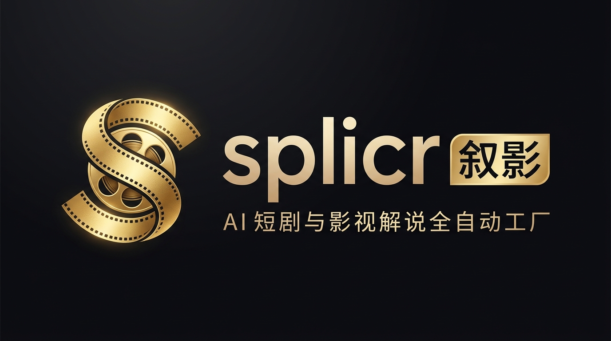
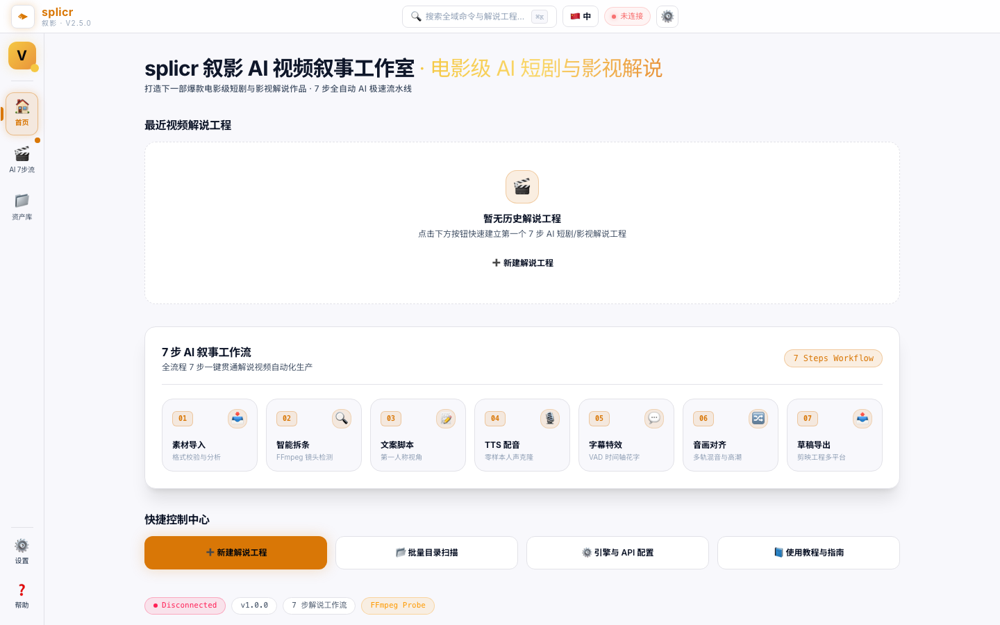
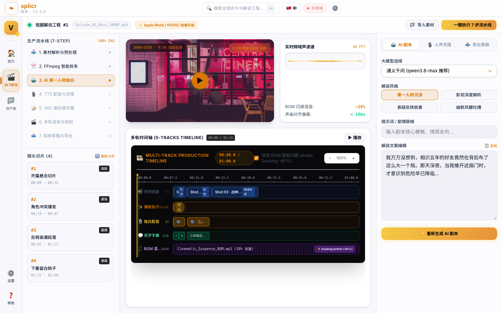
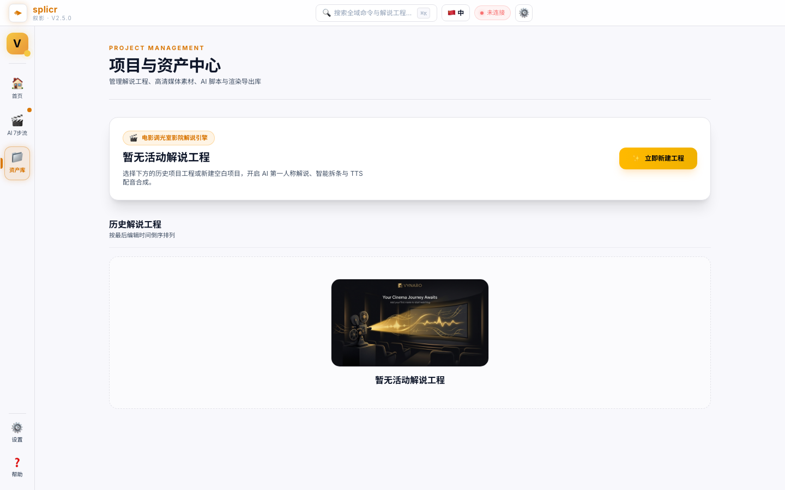
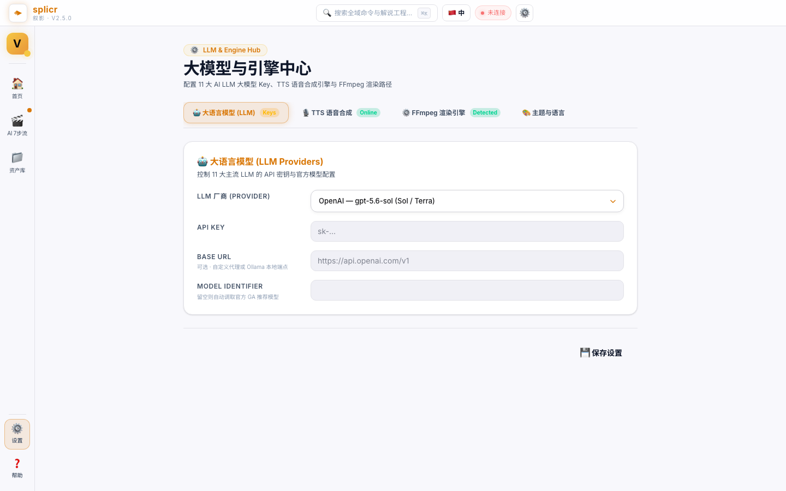
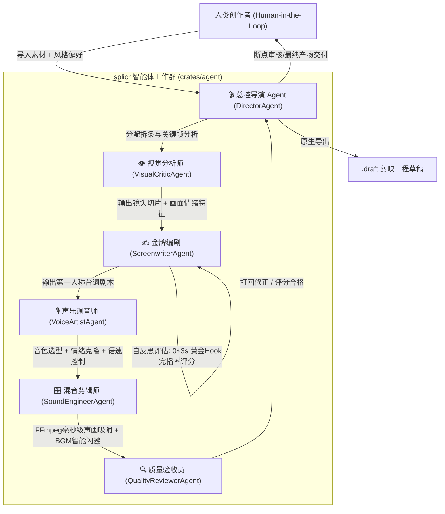

<!-- markdownlint-disable MD060 MD040 MD041 MD047 -->

<div align="center">



[](https://github.com/Agions/splicr/releases) [](https://tauri.app) [](https://www.rust-lang.org) [](https://react.dev) [](https://www.typescriptlang.org) [](LICENSE)  
[](https://github.com/Agions/splicr) [](https://github.com/Agions/splicr) [](https://github.com/Agions/splicr) [](https://github.com/Agions/splicr)

</div>

---

## 🎬 核心定位与设计理念

**splicr（叙影）** 是一款基于 **Rust Native 多智能体架构 + Tauri 2 + React 19** 深度研发的电影级桌面端 AI 视频叙事与解说生成引擎。

专为短剧拆条、影视解说、自媒体故事化创作者打造。通过 **三栏一体化专业集成工作台 (Integrated Cinema Studio)** 与 **6 大多智能体团队协作体系 (Multi-Agent Team)**，一键完成素材多模态抽帧、第一人称高潮独白撰写、人声克隆合成、5 轨毫秒级对齐与剪映工程草稿（`.draft`）原生交付。

---

## 🖥️ 桌面端真实运行界面展示

<div align="center">

| 首页 Dashboard 工程概览 | 三栏一体化 Multi-Agent 解说工作台 |
| :---: | :---: |
|  |  |

| 素材资产管理中心 | 11 大模型与 TTS 探针设置 |
| :---: | :---: |
|  |  |

</div>

---

## 🎭 Rust Native 多智能体协作架构 (Multi-Agent Team)



| 智能体角色 | 专业职责与能力底座 |
| :--- | :--- |
| **🎬 总控导演 (DirectorAgent)** | 全局任务规划、状态机流转调度、管理 `AgentContext` 与创作者断点交互 (HITL) |
| **👁️ 视觉分析师 (VisualCriticAgent)** | FFmpeg 场景切面探测、多模态关键帧提取、画面情绪峰值与张力打点 |
| **✍️ 金牌编剧 (ScreenwriterAgent)** | 生成 0~3s 黄金 Hook 与第一人称独白，内置 **完播率自反思评分回路 (Reflection Loop)** |
| **🎙️ 声乐调音师 (VoiceArtistAgent)** | 角色音色匹配、Edge-TTS / GPT-SoVITS 深度克隆与 48kHz 音频生成 |
| **🎛️ 混音剪辑师 (SoundEngineerAgent)** | 5 轨磁性时间轴毫秒级对齐（偏差 <18ms）与 BGM 智能闪避混流 (-18%) |
| **🔍 质量验收员 (QualityReviewerAgent)** | 审查多轨时间轴结构、违禁词扫描、草稿完整性与最终交付核验 (Score: 98/100) |

---

## 🧠 11 大主流大模型与人声克隆矩阵

### 11 大主流 LLM 引擎支持
* 🇨🇳 **通义千问 (Qwen)**: `qwen3.8-max` (首选推荐)
* 🇨🇳 **DeepSeek**: `deepseek-v4-pro` / `deepseek-v4-flash`
* 🇺🇸 **OpenAI**: `gpt-5.6-sol` / `gpt-4o`
* 🇺🇸 **Claude**: `claude-sonnet-5`
* 🇺🇸 **Gemini**: `gemini-3.6-flash` / `gemini-3.1-pro`
* 🇨🇳 **Kimi (月之暗面)**: `kimi-k3`
* 🇨🇳 **智谱 GLM**: `glm-5.2`
* 🇨🇳 **豆包 (Doubao)**: `doubao-seed-2-1-pro`
* 🇨🇳 **腾讯混元 (Hunyuan)**: `hunyuan-pro`
* 🏠 **本地离线模型 (Local)**: Ollama / LMStudio (`llama3.2` / `qwen2.5`)

---

## 🏛️ 项目结构与模块划分

```
splicr/
├── src/                  # React 19 + TypeScript 三栏专业工作台
├── src-tauri/            # Tauri 2.0 桌面端入口 (Rust IPC 注册与生命周期)
├── crates/
│   ├── agent             # Rust Native 多智能体协作与自反思调度引擎 (Director/Screenwriter...)
│   ├── core              # 核心基础设施 (AppContext / SplicrError / Translator)
│   ├── domain            # 核心领域模型 (Project / Timeline / MediaFile / Track)
│   ├── detect            # FFmpeg 智能探针 / 场景切片 / 多模态抽帧
│   ├── script            # 11 大主流 LLM 客户端与独白脚本引擎
│   ├── voice             # Edge-TTS / OpenAI-TTS / GPT-SoVITS 人声克隆
│   ├── subtitle          # FFmpeg silencedetect VAD 语音端点检测与字幕生成
│   ├── compose           # 7 步流水线状态机与 DAG 执行器
│   ├── export            # 剪映草稿 (.draft) 原生工程导出与防重矩阵
│   ├── storage           # 本地 SQLite / JSON 持久化存储
│   └── update            # 跨平台自动热更新引擎
└── docs/                 # VitePress 在线官方生产与开发文档中心
```

---

## 🛠️ 本地极速开发

```bash
# 1. 克隆代码仓库
git clone https://github.com/Agions/splicr.git
cd splicr

# 2. 安装前端依赖
pnpm install

# 3. 启动桌面端开发环境
pnpm tauri dev

# 4. 运行全套自动化测试
cargo test --all
pnpm test
```

---

## 📜 许可证

基于 **[MIT License](LICENSE)** 许可协议开源。

© 2026 Agions · Powered by Tauri 2, Rust & React 19
