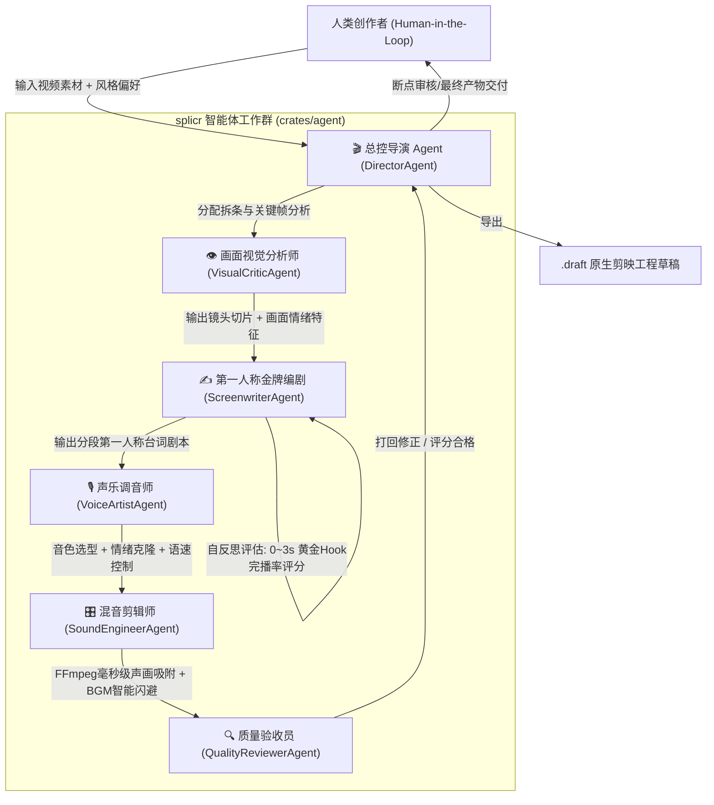

# 🤖 Multi-Agent 智能体协作体系详解

splicr 采用 **Rust Native 多智能体协作架构**，彻底打破传统单一线性流水线的局限。通过 **Director(总控导演)**、**VisualCritic(画面分析)**、**Screenwriter(金牌编剧)**、**VoiceArtist(声乐调音)**、**SoundEngineer(混音剪辑)** 与 **QualityReviewer(质量验收)** 6 大专家智能体协同与自反思回路，实现短剧影视解说的高完播率成片输出。

---

## 🎭 6 大智能体团队职责矩阵

### 1. 🎬 总控导演 (DirectorAgent)
- **核心职能**：会话状态机管理、任务 DAG 分发、实时协调专家智能体交互。
- **人机协同 (HITL)**：在编剧剧本生成、配音音色选型等核心节点设置 Breakpoints，向人类创作者呈送审批选项（批准继续 / 打回重写）。

### 2. 👁️ 画面视觉分析师 (VisualCriticAgent)
- **多模态抽帧**：自动通过 FFmpeg 提取 1080P 高清关键帧。
- **视觉张力感知**：通过多模态视觉模型感知角色面部情绪、动作冲突与转场节奏，自动标记高能切片。

### 3. ✍️ 第一人称金牌编剧 (ScreenwriterAgent)
- **第一人称沉浸独白**：将视觉关键帧直接编码灌入 Qwen 3.8 / DeepSeek V4 / GPT-5.6 等多模态大模型。
- **自反思完播率评分 (Reflection Loop)**：针对 0~3s 黄金前置 Hook 进行完播率自评与多轮推演迭代，保证解说抓人眼球。

### 4. 🎙️ 声乐调音师 (VoiceArtistAgent)
- **高保真语音合成**：支持 Edge-TTS 与 OpenAI-TTS。
- **零样本声音克隆**：直连本地 GPT-SoVITS 服务，仅需 5 秒样本音频即可完成角色音色克隆。

### 5. 🎛️ 混音剪辑师 (SoundEngineerAgent)
- **5 轨多轨编排**：视频切片轨、0~3s Hook 轨、第一人称配音轨、逐字字幕轨、BGM 混流轨。
- **智能闪避混音**：配音响起时自动降低 BGM 音量 (-18%)，声画同步公差控制在 18ms 以内。

### 6. 🔍 质量验收员 (QualityReviewerAgent)
- **双重验收**：执行违禁词扫描、对齐公差校验与工程草稿完整性核验，达标后交付剪映工程草稿。

---

## 🎙️ Web Audio Canvas 实时频域波形图 (Spectrum Visualizer)

工作台中内置了基于 HTML5 **Web Audio API** (`AudioContext` + `AnalyserNode`) 的 2D Canvas 实时波形渲染器：
- **实时频域分析**：在试听与合成配音播放时，实时采集 48 频段 FFT 频谱与时域信号。
- **黑曜石金黄美学**：呈现琥珀发光柱 (`#F5C842`) 与动态跳动粒子，带有待机呼吸微动画。

---

## 📖 相关推荐文档

* [快速开始](/guide/quick-start) — 3 分钟创建第一个解说工程
* [界面与功能指南](/guide/interface) — 三栏一体化工作台操作详解
* [AI 与模型配置](/guide/ai-configuration) — 11 大模型与 TTS 引擎配置
* [导出与发布](/guide/exporting) — 剪映草稿导出与防重矩阵说明
