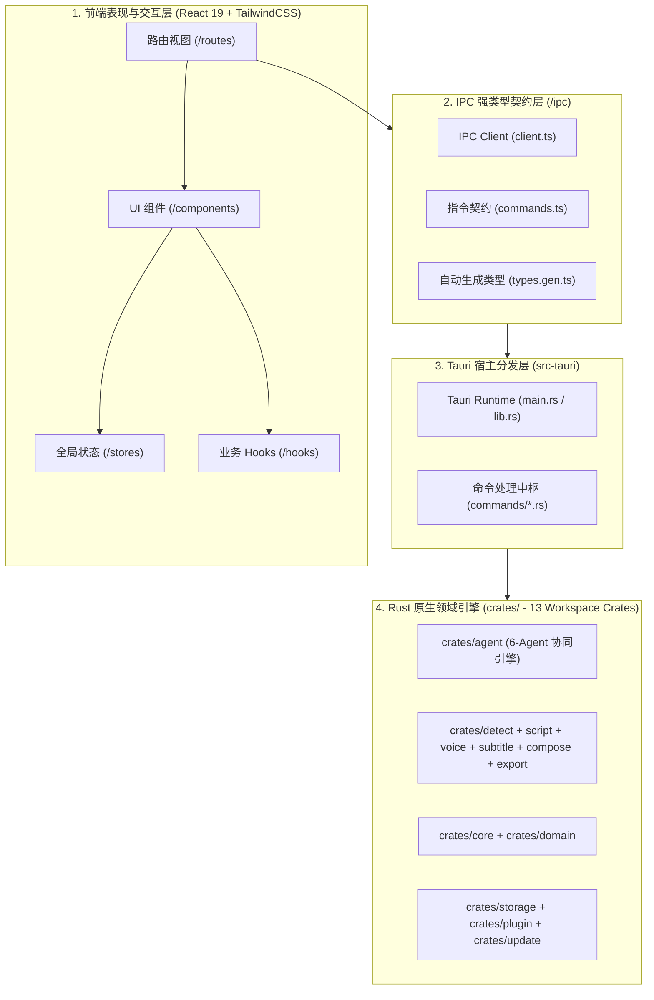

# 系统架构与全栈命名规范

::: tip 架构定位
`splicr` (叙影) 是一款基于 **Tauri 2.0 + Rust Native Crates + React 19 / TypeScript** 构建的工业级影视短剧 AI 叙事工厂。本文档定义系统的分层架构、模块边界与团队协同全栈命名标准。
:::

## 1. 系统分层与拓扑设计

项目严格遵循单向依赖与关注点分离原则，分为四层架构体系：

---

## 2. 核心 Crate 与职责边界

Rust Workspace 由 13 个独立微 Crate 组成，各 Crate 职责定义如下：

| Crate 模块 | 职责与功能定位 | 依赖关系 |
| :--- | :--- | :--- |
| `crates/core` | 核心抽象、错误体系 (`SplicrError`)、跨 Crate Trait 契约 | 纯基础库 (零业务依赖) |
| `crates/domain` | 领域模型 (`Project`, `Scene`, `Script`, `Clip`, `AudioTrack`) | 依赖 `core` |
| `crates/agent` | 6 大 Multi-Agent 智能体协作中枢 (Director / Screenwriter / QA...) | 依赖 `core`, `domain`, `script` |
| `crates/intake` | Step 1: 媒体导入、元数据探针 (FFprobe) 与缩略图提取 | 依赖 `core`, `domain` |
| `crates/detect` | Step 2: FFmpeg 场景突变检测、情绪峰值打点与关键帧捕获 | 依赖 `core`, `domain` |
| `crates/script` | Step 3: 11 大最新大模型矩阵 (Qwen 3.8 / GPT-5.6 / DeepSeek V4...) | 依赖 `core`, `domain` |
| `crates/voice` | Step 4: 48kHz 影视配音与 GPT-SoVITS 零样本人声克隆 | 依赖 `core`, `domain` |
| `crates/subtitle` | Step 5: VAD 毫秒级静音断句、SRT/ASS 动态字幕生成 | 依赖 `core`, `domain` |
| `crates/compose` | Step 6: 5 轨毫秒级磁性对齐、BGM 避让 (-6dB) 与混流渲染 | 依赖 `core`, `domain`, `voice`, `subtitle` |
| `crates/export` | Step 7: 剪映 PC 端原生工程草稿 (`.draft`) 导出与多平台发布预设 | 依赖 `core`, `domain`, `compose` |
| `crates/storage` | 本地持久化 (SQLite / JSON)、Keychain 敏感密钥隔离 | 依赖 `core`, `domain` |
| `crates/plugin` | WASM 插件热插拔扩展运行时 | 依赖 `core` |
| `crates/update` | 跨平台版本检查与自动热更新引擎 | 依赖 `core` |

---

## 3. 全栈命名规范标准

### 3.1 Rust 后端规范

- **Crate 命名**：小写 `kebab-case`（如 `splicr-script`）。
- **文件与 Module**：小写 `snake_case.rs`（如 `deepseek.rs`, `vad.rs`）。
- **Struct / Enum**：`PascalCase`（如 `ProjectRecord`, `LlmProviderKind`）。
- **Trait 接口**：`PascalCase`（名词或形容词，如 `LlmProvider`, `Savable`，严禁 `I` 前缀）。
- **函数 / 方法**：`snake_case`（动词+名词，如 `create_blank()`, `detect_scenes()`）。
- **常量 / 静态变量**：`SCREAMING_SNAKE_CASE`（如 `DEFAULT_SAMPLE_RATE`）。
- **Tauri Command**：`snake_case`（格式 `[domain]_[action]_[object]`，如 `project_create_blank`）。

### 3.2 TypeScript / React 前端规范

- **组件文件**：`PascalCase.tsx`（如 `MultiTrackTimeline.tsx`, `AudioWaveformVisualizer.tsx`）。
- **路由视图**：`kebab-case.tsx`（如 `index.tsx`, `production.tsx`, `settings.tsx`）。
- **自定义 Hook**：`use` + `PascalCase.ts`（如 `useAssets.ts`, `useProject.ts`）。
- **Zustand Store**：`kebab-case-store.ts`（如 `project-store.ts`，导出 `useProjectStore`）。
- **工具库**：`kebab-case.ts`（如 `i18n.ts`, `probe.ts`, `bytes.ts`）。
- **类型契约**：`PascalCase`（如 `ConfigSnapshot`, `MediaFile`，严禁 `I` 前缀）。

### 3.3 Tauri IPC 契约通信规范

- **指令映射**：后端 `snake_case` 经由 `scripts/gen-ipc.mjs` 自动映射为前端 `camelCase`（如 `project_create_blank` ➔ `projectIpc.createBlank()`）。
- **事件命名**：统一采用 `domain:entity:action` 格式（如 `pipeline:step:progress`, `agent:thought:updated`）。
- **返回契约**：所有 IPC 统一返回 `SplicrResult<T>`，错误自动归一化映射为 `SplicrError`。

---

## 4. 架构防劣化红线

1. **零过时模型**：所有大模型集成必须保持各厂商最新旗舰代际。
2. **主题自适应**：禁止在组件内写死纯黑硬编码背景，统一使用 `--color-surface` / `--color-bg`。
3. **Clippy 零警告**：`cargo clippy` 保持 0 warnings，禁止随意引入 `unsafe`。
4. **强类型无逃逸**：`pnpm tsc --noEmit` 保持 0 errors，禁止使用 `@ts-ignore`。
