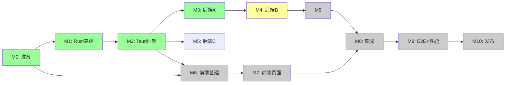

# SceneFab v3.0 · 分阶段实施路线图 + 任务拆分

> **基线版本**：v3.0.0
> **关联文档**：[00-overview.md](./00-overview.md) · [02-target-architecture.md](./02-target-architecture.md) · [03-rust-backend.md](./03-rust-backend.md) · [06-frontend-react.md](./06-frontend-react.md) · [07-tauri-integration.md](./07-tauri-integration.md)
> **本文档范围**：10 个里程碑（M0-M10，42 周）、团队拆分（2 人核心 + 2 人支撑）、依赖图、PoC 验证关卡（Go/No-Go）、交付物清单、并行任务、阶段评审、定期 sync 节奏。

## 0. TL;DR

```
┌──────────────────────────────────────────────────────────────────────────┐
│                          v3.0 整体时间表（42 周）                          │
└──────────────────────────────────────────────────────────────────────────┘

Week:  1   2   3   4   5   6   7   8   9  10  11  12  13  14  15  16
       ├───┴───┬───┴───┬───┴───┬───┴───┬───┴───┬───┴───┬───┴───┬───┴───┤
       M0      M1      M2      M3      M4      M5      M6      M7
       准备    基建    基建    后端A   后端B   后端C   前端A   前端B
       (环境)  (Rust)  (Tauri) (配置)  (视频)  (LLM)   (布局)  (页面)

Week: 17  18  19  20  21  22  23  24  25  26  27  28  29  30  31  32
       ├───┴───┬───┴───┬───┴───┬───┴───┬───┴───┬───┴───┬───┴───┬───┴───┤
       M7      M8      M8      M9      M9      M9      M10
       集成    前端C   前端D   E2E     性能    可观察  发布
       (IPC)   (主题)  (i18n)  (测试)  (调优)  (追踪)

Week: 33  34  35  36  37  38  39  40  41  42
       ┌──────────────────────────────────────────────────────┐
       │             M10 灰度发布 + 客户支持                    │
       └──────────────────────────────────────────────────────┘
```

## 1. 团队结构

### 1.1 角色分配

| 角色                 | 人数 | 能力要求                           | 主要责任                                    |
| -------------------- | ---- | ---------------------------------- | ------------------------------------------- |
| **TL** (Tech Lead)   | 1    | Rust + TS + 全栈 + 架构            | 全局架构、ADR 决策、跨 crate 集成、风险评审 |
| **RA** (Rust 工程师) | 1    | Rust + tokio + 多媒体处理          | 6 个领域 crate + Tauri commands + 测试      |
| **FE** (前端工程师)  | 1    | React 18 + TS + Tauri 经验         | apps/desktop 全部前端代码 + 视觉回归        |
| **QA** (测试工程师)  | 0.5  | Playwright + cargo test + 迁移测试 | E2E + 性能基线 + 回归策略                   |

> 最小编制：**3.5 人**（TL + RA + FE + 0.5 QA）。如可投入 5 人，可在 M5 增加 1 名 i18n/UX 工程师 + 1 名 LLM/算法工程师。

### 1.2 RACI（决策权）

| 任务               | TL  | RA  | FE  | QA  |
| ------------------ | --- | --- | --- | --- |
| 架构 ADR           | A   | C   | C   | I   |
| Rust crate 边界    | A   | R   | C   | I   |
| Tauri Command 签名 | A   | R   | C   | I   |
| 前端组件库选择     | C   | I   | A   | I   |
| 设计令牌迁移       | C   | I   | A   | C   |
| 自动化测试         | C   | C   | C   | A   |
| Release 决策       | A   | C   | C   | C   |
| 回滚决策           | A   | C   | C   | C   |

A=Accountable, R=Responsible, C=Consulted, I=Informed

## 2. 10 个里程碑详解

### M0 — 准备 + 立项（第 1-2 周，2 周）

**目标**：建仓库骨架 + 评估指标基线 + 立项签到

| #   | 任务                                                           | Owner | 工时 | 交付物                     |
| --- | -------------------------------------------------------------- | ----- | ---- | -------------------------- |
| 0.1 | 在 GitHub 建 `scenefab/v3` 分支，配置 branch protection        | TL    | 1d   | 分支规则                   |
| 0.2 | 配置 CI（GitHub Actions）+ secrets（GH_TOKEN, CARGO_TOKEN）    | TL    | 1d   | `.github/workflows/ci.yml` |
| 0.3 | 评估 v2.4 主仓库体积 / 依赖 / 测试覆盖率 / ABI 边界            | TL    | 2d   | 评估报告                   |
| 0.4 | 创建 Cargo workspace + 13 个 crate 的空壳（`cargo new --lib`） | RA    | 2d   | Cargo.toml 拓扑完成        |
| 0.5 | 创建 `apps/desktop/` + 配置 Vite + pnpm                        | FE    | 2d   | `pnpm dev` 能跑起空壳      |
| 0.6 | 录制 v2.4 主流程冒烟视频（基准）                               | QA    | 1d   | 6 段视频（每个核心页面）   |
| 0.7 | 录制关键 API 行为（OpenAPI / SSE 抽样）                        | QA    | 1d   | `baseline/api-samples.har` |
| 0.8 | 立项评审会（第 1 轮 sign-off）                                 | 全部  | 1d   | 会议纪要 + 同意书          |

**PoC 关卡（Go/No-Go）**:

- [ ] Rust workspace 能 `cargo build --workspace`，所有 13 个 crate 各自编译通过
- [ ] `apps/desktop` 能 `pnpm tauri dev` 启动一个空白 Tauri 窗口
- [ ] CI green on first push

---

### M1 — Rust 基础设施（第 3-4 周，2 周）

**目标**：所有 13 个 crate 落地最小实现 + common 模块（error/log/trace）

| #   | 任务                                                                   | Owner | 工时 |
| --- | ---------------------------------------------------------------------- | ----- | ---- |
| 1.1 | `scenefab-core`：定义 `SceneFabError` / `PathPolicy` / `Result` / 日志 | RA    | 3d   |
| 1.2 | `scenefab-domain`：placeholder for 5 步流水线 trait 定义               | RA    | 2d   |
| 1.3 | `scenefab-ffmpeg`：编译 ffmpeg-sys-next，封装基本 probe/encode         | RA    | 4d   |
| 1.4 | 选型 + 落地 `tracing` + `tracing-subscriber` + 文件日志                | RA    | 1d   |
| 1.5 | 落 `tauri-plugin-system-tray` / `single-instance` / `autostart`        | RA    | 2d   |
| 1.6 | 把 v2.4 `app_config.yaml` schema 翻译为 Rust 结构 + 加载器             | RA    | 2d   |
| 1.7 | PoC：把 v2.4 的 `app/main.py` 一个 `--version` 行为用 CLI 重现         | RA    | 1d   |
| 1.8 | `cargo test --workspace` 全绿（即便 placeholder）                      | RA    | 1d   |

**PoC 关卡**:

- [ ] 跑 `cargo build --release --workspace` < 5分钟
- [ ] `bin/scenefab --version` 输出 `3.0.0-alpha.0`
- [ ] 所有 crate `cargo clippy -- -D warnings` 0 警告

---

### M2 — Tauri 框架搭建（第 5-6 周，2 周）

**目标**：Tauri shell 跑起来 + 第一个 command + Capability 设计

> 注: 历史版本以 `scenefab-tauri-app/` 为 Tauri crate 名,M1 实施时迁移至
> `apps/desktop/src-tauri/`,本表项沿用现状命名。

| #   | 任务                                                             | Owner | 工时 |
| --- | ---------------------------------------------------------------- | ----- | ---- |
| 2.1 | `apps/desktop/src-tauri`：`tauri.conf.json` + 图标 + 启动 logo   | FE    | 2d   |
| 2.2 | `capabilities/default.json` 设计：35 个命令的 ACL                | TL    | 1d   |
| 2.3 | 第一个 command：`get_app_info` + specta 导出                     | RA    | 1d   |
| 2.4 | 前端收到 TS 类型 generated，TanStack Query 调用第一个命令        | FE    | 1d   |
| 2.5 | `Cargo features`：dev/release/profile 切换 + 启动期 self-check   | RA    | 1d   |
| 2.6 | `apps/desktop/src-tauri/src/lib.rs` 的 `run()` 骨架 + AppContext | RA    | 2d   |
| 2.7 | 自动启动 + 单实例 + 窗口状态插件接入                             | RA    | 1d   |
| 2.8 | SHA-256 校验 + 自动更新检查插件（仅占位，不实装）                | RA    | 1d   |
| 2.9 | 第 2 轮评审（中段检查）                                          | 全部  | 1d   |

**PoC 关卡**:

- [ ] 启动后 5 秒内窗口可见
- [ ] `getAppInfo()` 在前端能取到 `version: "3.0.0-alpha.0"`
- [ ] CSP + 路径白名单 + keyring 三道安全都已生效

---

### M3 — 后端 A：配置 + 项目 + 资源（第 7-9 周，3 周）

**目标**：把 v2.4 的 `config/` + `project/` + `services/assets` 模块完整迁移

| #   | 任务                                                                 | Owner | 工时 |
| --- | -------------------------------------------------------------------- | ----- | ---- |
| 3.1 | `scenefab-config`：5 性能 profile + LlmProvider 路由 + 热重载        | RA    | 4d   |
| 3.2 | `scenefab-config`：environment / yaml / keyring 三层 fallback        | RA    | 3d   |
| 3.3 | `scenefab-domain::project`：Project / Timeline / MediaFile 模型      | RA    | 5d   |
| 3.4 | `scenefab-domain::project`：`serde` 序列化 + `.scenefab` JSON schema | RA    | 3d   |
| 3.5 | `scenefab-domain::assets`：资源注册表 + import / list / delete       | RA    | 4d   |
| 3.6 | 迁移 `ProjectManager` 所有公共方法到 Rust                            | RA    | 6d   |
| 3.7 | 迁移 `AssetService`（含 path 白名单接入）                            | RA    | 3d   |
| 3.8 | 单元测试：单测覆盖率 ≥ 70%（迁移部分）                               | RA    | 3d   |
| 3.9 | Tauri commands：`project::*` + `assets::*` 完成 + 前端集成           | RA+FE | 4d   |

**PoC 关卡**:

- [ ] 能用 Tauri 命令打开一个真实 `.scenefab` 项目
- [ ] 资源导入/删除/列表在前端可见
- [ ] 配置改动持久化到 `keyring-rs` + yaml
- [ ] 单测覆盖率门禁通过

---

### M4 — 后端 B：视频 + 导出（第 10-12 周，3 周）

**目标**：迁移 `app/services/video/`（包括 ffmpeg 包装 + monologue maker + exporter）

| #   | 任务                                                                        | Owner | 工时 |
| --- | --------------------------------------------------------------------------- | ----- | ---- |
| 4.1 | `scenefab-ffmpeg`：probe/demux/encode 完整封装（基于 ffmpeg-sys-next）      | RA    | 6d   |
| 4.2 | `scenefab-ffmpeg`：进度推送（`--progress pipe:1` → tokio::sync::broadcast） | RA    | 3d   |
| 4.3 | `scenefab-video`：4 种多视频策略：single/concat/batch/series                | RA    | 4d   |
| 4.4 | `scenefab-pipeline::monologue_maker`：5 步核心 trait                        | RA    | 4d   |
| 4.5 | `scenefab-export`：3 模式（quick/custom/silent）+ 性能 profile 适配         | RA    | 4d   |
| 4.6 | `scenefab-pipeline`：状态机（XState 同步对应）+ runner 抽象                 | RA    | 5d   |
| 4.7 | Tauri commands：`pipeline::*` + `export::*` + 事件总线                      | RA+FE | 5d   |
| 4.8 | 冒烟：上传 1 个 MP4 → 走完 5 步（noop）→ 产出 .mp4                          | QA+RA | 3d   |
| 4.9 | 性能基线：导出 1 分钟 1080p30 < 90s（v2.4 基线 120s）                       | QA    | 2d   |

**PoC 关卡**:

- [ ] 5 步流水线（noop）能在 Rust 跑完
- [ ] ffmpeg 调用稳定
- [ ] 导出 P95 时延 < v2.4 基线 \* 0.85

---

### M5 — 后端 C：LLM + TTS + 帮助 + 插件（第 13-15 周，3 周）

**目标**：迁移 `app/services/` 剩余 + plugins/updater 完整可工作

| #    | 任务                                                                          | Owner | 工时 |
| ---- | ----------------------------------------------------------------------------- | ----- | ---- |
| 5.1  | `scenefab-llm`：11 Provider + LlmProvider trait + Manager + fallback          | RA    | 6d   |
| 5.2  | `scenefab-llm`：流式响应（tokio + AsyncRead）                                 | RA    | 3d   |
| 5.3  | `scenefab-llm`：参数消毒 + 重试 + 熔断                                        | RA    | 3d   |
| 5.4  | `scenefab-tts`：3 Provider（edge-tts / dashscope / local）                    | RA    | 5d   |
| 5.5  | `scenefab-tts`：音频流到文件 + 字幕生成                                       | RA    | 3d   |
| 5.6  | `scenefab-i18n`：翻译文件加载 + Locale 切换 + Rust 端文案                     | RA    | 2d   |
| 5.7  | `scenefab-help`：内置帮助文档解析 + 搜索                                      | RA    | 2d   |
| 5.8  | `scenefab-plugin`：wasmtime 沙箱 + TOML manifest + host import                | RA    | 6d   |
| 5.9  | `scenefab-update`：5 阶段状态机 + GitHub Releases + SHA-256 校验              | RA    | 4d   |
| 5.10 | Tauri commands：`llm::*` + `theme::*` + `update::*` + `help::*` + `plugin::*` | RA+FE | 4d   |
| 5.11 | 单测覆盖率 ≥ 70%                                                              | QA    | 2d   |
| 5.12 | 第 3 轮评审                                                                   | 全部  | 1d   |

**PoC 关卡**:

- [ ] 11 个 LLM Provider 至少 5 个跑通单元测试
- [ ] TTS 能产出 30 秒音频
- [ ] 插件 WASM 能 sandbox 运行 + 调用 host import
- [ ] 更新器能从 mock URL 检测到 + SHA-256 校验通过

---

### M6 — 前端基础（第 16-17 周，2 周）

**目标**：前端项目结构 + 路由 + UI 库 + 设计令牌迁移

| #   | 任务                                                       | Owner | 工时 |
| --- | ---------------------------------------------------------- | ----- | ---- |
| 6.1 | `apps/desktop` 工程初始化 + Vite + Tailwind v4 + shadcn/ui | FE    | 2d   |
| 6.2 | TanStack Router 文件式路由配置 + 6 路由占位                | FE    | 2d   |
| 6.3 | Zustand 6 store 落地 + persist + 主题/语言                 | FE    | 2d   |
| 6.4 | `ds_tokens.py` → `design-tokens.json` → CSS variables      | FE    | 3d   |
| 6.5 | shadcn/ui 20+ 组件生成 + dark/light 切换 < 80ms            | FE    | 2d   |
| 6.6 | AppShell + TopBar + Sidebar + ContentArea + StatusBar 实现 | FE    | 3d   |
| 6.7 | 标题栏 macOS 红绿黄 + 拖拽区 + 系统菜单集成                | FE    | 1d   |
| 6.8 | 命令面板（cmdk）+ 30 条默认命令注册                        | FE    | 2d   |
| 6.9 | 全局快捷键（Cmd+K/F1/Cmd+,）                               | FE    | 1d   |

**PoC 关卡**:

- [ ] 主题切换 < 100ms（P95）
- [ ] 6 路由均能 navigate
- [ ] 命令面板能搜索 30 条
- [ ] 全局快捷键能触发

---

### M7 — 前端页面与状态机（第 18-20 周，3 周）

**目标**：6 个页面 + 5 步流水线 reducer + 系统指标 dashboard

| #    | 任务                                                        | Owner | 工时 |
| ---- | ----------------------------------------------------------- | ----- | ---- |
| 7.1  | HomePage + 4 KpiCard + RecentProjectsList                   | FE    | 2d   |
| 7.2  | ProductionPage + XState pipeline machine + 5 步卡片         | FE    | 5d   |
| 7.3  | Pipeline ETA Web Worker（Comlink）+ 滑动窗口                | FE    | 2d   |
| 7.4  | AssetsPage + 拖拽 + 缩略图 + 最近项目                       | FE    | 3d   |
| 7.5  | SettingsPage + 11 LLM Provider + 性能 profile + 密钥管理 UI | FE    | 4d   |
| 7.6  | UpdatePage + 5 阶段 UI + 进度条                             | FE    | 2d   |
| 7.7  | HelpPage + 搜索 + 文档渲染                                  | FE    | 2d   |
| 7.8  | DashboardWidget + CPU/memory 60-sample chart + 1Hz 推送     | FE    | 3d   |
| 7.9  | i18next 接入 + zh-CN/en-US 488+474 key 全数导入             | FE    | 4d   |
| 7.10 | Accessibility 审查 + axe 0 严重问题                         | QA    | 2d   |
| 7.11 | 视觉回归基线截图（6 页面 × 2 主题 = 12 截图）               | QA    | 2d   |

**PoC 关卡**:

- [ ] 6 页面 Lighthouse ≥ 90（桌面）
- [ ] axe-core 0 violations
- [ ] i18n 全数 key 全部命中
- [ ] 流水线 happy path 完成

---

### M8 — 集成 + 主题 + i18n + 错误边界（第 21-23 周，3 周）

**目标**：把 Rust 后端与 React 前端真正接通 + 全栈一致性

| #    | 任务                                            | Owner | 工时 |
| ---- | ----------------------------------------------- | ----- | ---- |
| 8.1  | 35 个 commands 全数接通 + TypeScript 类型零漂移 | 全员  | 5d   |
| 8.2  | 24 个事件全数接通 + EventRegistry 自动校验      | RA+FE | 3d   |
| 8.3  | ErrorBoundary + toUserReadableError 完整覆盖    | FE    | 2d   |
| 8.4  | 主题持久化跨重启（keyring + sync 到 Rust 端）   | RA+FE | 2d   |
| 8.5  | 系统托盘 + 11 菜单项全数接通                    | RA+FE | 2d   |
| 8.6  | 单实例 + 二次启动 focus                         | RA    | 1d   |
| 8.7  | 应用启动等待页（Splash）动画 + 初始化进度       | FE    | 2d   |
| 8.8  | 全部 React Query 缓存一致性测试                 | QA    | 2d   |
| 8.9  | 19 个核心服务的 feature flag（远程可配置）      | RA    | 3d   |
| 8.10 | 第 4 轮评审（功能完成性检查）                   | 全部  | 1d   |

**PoC 关卡**:

- [ ] 全部命令/事件均能正常调用/订阅
- [ ] LSP + tsc 0 错误
- [ ] 主题/语言重启后保留
- [ ] 性能基线（冷启动/路由切换）达标

---

### M9 — E2E + 性能 + 可观察（第 24-26 周，3 周）

**目标**：把 v2.4 全部 6 段冒烟视频 + 11 个核心场景全部跑通

| #    | 任务                                                    | Owner | 工时 |
| ---- | ------------------------------------------------------- | ----- | ---- |
| 9.1  | Playwright 4 条冒烟 + 11 条回归                         | QA    | 5d   |
| 9.2  | 视觉回归（≥ 1% 像素差异 = 失败）                        | QA    | 2d   |
| 9.3  | 性能调优：bundle 拆分 + 冷启动 < 500ms                  | FE    | 4d   |
| 9.4  | 性能调优：5 步流水线 P95 < v2.4 \* 0.85                 | RA    | 4d   |
| 9.5  | tracing 仪表盘 + 关键路径 span 覆盖率                   | RA    | 3d   |
| 9.6  | 日志收集 + 上报 (可选, M10 决定)                        | RA    | 2d   |
| 9.7  | 错误边界 + 用户错误上报 + 帮助文档跳转                  | FE    | 2d   |
| 9.8  | 跨平台冒烟：macOS / Windows / Linux (各 2 小时手工冒烟) | QA    | 3d   |
| 9.9  | 数据迁移：旧 `.narrafilm` → `.scenefab` 转换工具        | RA    | 3d   |
| 9.10 | DoD 检查清单（详见 10-acceptance.md）                   | 全部  | 2d   |

**PoC 关卡**:

- [ ] Playwright 15/15 稳定绿
- [ ] 三个平台均能冷启动 < 500ms / 渲染 < 100ms
- [ ] 数据迁移 0 数据丢失
- [ ] DoD 检查清单 100% 通过

---

### M10 — 灰度发布 + 客户支持（第 27-42 周，16 周）

**目标**：滚动发布 + 客户支持 + 全部回滚预案演练就位

| #    | 任务                                                     | Owner | 工时 |
| ---- | -------------------------------------------------------- | ----- | ---- |
| 10.1 | 内部 alpha（10 用户）→ beta（100 用户）→ RC（1000 用户） | TL    | 全部 |
| 10.2 | 自动更新启动 + 增量包 + SHA-256                          | RA    | all  |
| 10.3 | 客户支持：收集 issue → triage → 回滚判断                 | 全员  | all  |
| 10.4 | 性能基线持续监控 + 异常告警                              | QA    | all  |
| 10.5 | 旧 Python 主线进入"只读维护期"（仅修关键 bug）           | TL    | 持续 |
| 10.6 | v3.0 GA 公告 + 用户教育                                  | TL    | 1d   |
| 10.7 | v3.1 路线图（patch 行情、批量项目、新 LLM Provider）     | TL    | all  |
| 10.8 | 旧 Python 代码冻结 → 标记 DEPRECATED → v3.2 完全删除     | TL    | 2d   |

**PoC 关卡**:

- [ ] RC 阶段用户留存 ≥ 85%
- [ ] P95 崩溃率 < 0.1%
- [ ] 自动更新成功率 ≥ 95%
- [ ] 关键路径 issue P1 响应 < 4h

## 3. 关键依赖图



> **关键路径**：M0 → M1 → M2 → M3 → M4 → M5 → M8 → M9 → M10（共 33 周）。
>
> **可并行**：M4（后端 B 视频）与 M6（前端基建）可同步开始（互不依赖）。M5（后端 C LLM）与 M7（前端页面）可同步。

## 4. PoC 关卡汇总

| 关卡 ID    | 阶段验收点 | 必须 Go（否则 No-Go 进入下一阶段）                                   |
| ---------- | ---------- | -------------------------------------------------------------------- | ----- |
| **Gate0**  | M0 末      | 13 个 crate 各自编译 + Tauri 空壳启动 + CI green                     | ✅ Go |
| **Gate1**  | M1 末      | `bin/scenefab --version` + clippy 0 警告 + 日志输出                  | ✅ Go |
| **Gate2**  | M2 末      | `getAppInfo` + CSP + Path白名单 + keyring                            | ✅ Go |
| **Gate3**  | M3 末      | 打开 `.scenefab` + 资源增删 + 配置持久化                             | ✅ Go |
| **Gate4**  | M4 末      | 5 步 noop 跑通 + 导出 mp4 + 性能 -15%                                | ✅ Go |
| **Gate5**  | M5 末      | 5 个 LLM Provider + TTS + 插件 sandbox + 更新器                      | ✅ Go |
| **Gate6**  | M6 末      | 主题切换 < 100ms + 6 路由 + 命令面板                                 | ✅ Go |
| **Gate7**  | M7 末      | Lighthouse ≥ 90 + axe 0 + i18n 全 + 流水线 happy path                | ✅ Go |
| **Gate8**  | M8 末      | 全 commands/events 接通 + 主题持久化 + LSP 0 错误                    | ✅ Go |
| **Gate9**  | M9 末      | Playwright 15/15 + 3 平台冷启动 < 500ms + 数据迁移 0 丢失 + DoD 100% | ✅ Go |
| **Gate10** | M10 RC     | 用户留存 ≥ 85% + 崩溃率 < 0.1% + 更新成功率 ≥ 95%                    | ✅ GA |

> 每个 Gate 都需要：
>
> 1. 自动化验证（脚本/CI 退出码 0）
> 2. 手工冒烟（QA 走完主流程）
> 3. 会议评审（TL/RA/FE 三方签字）

## 5. 风险触发的应急路径

> 详见 [09-risk-rollback.md](./09-risk-rollback.md)。

| 风险触发                     | 应急路径                                               |
| ---------------------------- | ------------------------------------------------------ |
| Gate3 不过                   | 暂停 Rust 迁移，回退到 PySide6 主线；M4 +2 周          |
| Gate5 不过（LLM/TTS 太多坑） | 切到"渐进式"：先做 +5 个核心 Provider，其余留待 v3.0.x |
| Gate6 不达（首屏时间不达标） | shadcn/ui → 减少动画 + 拆分 chunk + 砍主题运行时切换   |
| Gate9 E2E 大量失败           | 分批回滚：仅核心 4 条冒烟先保证，其余推迟到 v3.1       |
| 数据迁移丢失                 | 触发回滚：v3.0 暂不发，只发"v3.0 升级工具"             |
| 自动更新断链                 | 阻止 GA，强制手动下载                                  |

## 6. 定期同步节奏

| 频率     | 会议              | 时长  | 内容                               |
| -------- | ----------------- | ----- | ---------------------------------- |
| Daily    | Standup           | 15min | 昨日完成 / 今日计划 / 阻塞点       |
| 周一上午 | Sprint Plan       | 1h    | 本周目标对齐（详见 §7）            |
| 周五下午 | Sprint Review     | 1h    | 上周成果演示 + Gate 验收           |
| 双周一次 | 架构评审（Amber） | 2h    | 重大架构决策（影响后续 ADR）       |
| 月度     | Risk Review       | 2h    | Gate 验收回顾 + 风险矩阵更新       |
| 季度     | 路线图复盘        | 3h    | 重新评估 M3-M10 时间表 + v3.1 预备 |

## 7. Sprint 节奏

> 把每个 M 切为 4-8 个 Sprint（每个 Sprint 2 周）。下面是 1 个 Sprint 的通用模板：

```text
Sprint N (2 周)
  Day 1 (Mon)     Sprint Plan: 拆 stories → tasks
  Day 1-9         执行 + 每日 standup
  Day 9 (Thu)     工件 demo + 集成测试
  Day 10 (Fri)    Sprint Review + Retro + 下 Sprint 计划
```

## 8. 交付物矩阵

每个 M 必须产生的工件：

| Milestone | 文档                                | 代码                             | 测试                        |
| --------- | ----------------------------------- | -------------------------------- | --------------------------- |
| M0        | 立项评审纪要、ADR-0001 仓库治理     | 仓库骨架 + CI                    | CI green                    |
| M1        | ADR-0002 错误契约、ADR-0003 tracing | 13 个 crate 骨架                 | `cargo test --workspace`    |
| M2        | ADR-0004 Capability ACL             | `apps/desktop/src-tauri` 壳子    | `getAppInfo` smoke          |
| M3        | ADR-0005 配置三层 fallback          | project / assets 全套命令        | 单元 70%，集成 80%          |
| M4        | ADR-0006 多视频策略                 | pipeline / export 命令           | 5 步冒烟 + 导出性能         |
| M5        | ADR-0007 插件沙箱                   | llm / tts / update / plugin 命令 | 5 LLM Provider 单测         |
| M6        | ADR-0008 shadcn + Tailwind v4       | apps/desktop 工程                | 设计令牌快照对比            |
| M7        | ADR-0009 XState 5 步流水线          | 6 页面 + 4 hooks                 | Playwright 5 场景           |
| M8        | ADR-0010 IPC 契约冻结               | 集成完成                         | 集成 E2E 8 条               |
| M9        | ADR-0011 DoD 清单                   | 优化完毕 + 数据迁移工具          | Playwright 15/15 + 视觉回归 |
| M10       | v3.0 GA 公告                        | GA 标签                          | RC 留存指标                 |

---

> **结尾**：下一节进入 **09-risk-rollback.md**：12 类风险 + 应急预案 + 回滚策略 + 触发条件。
